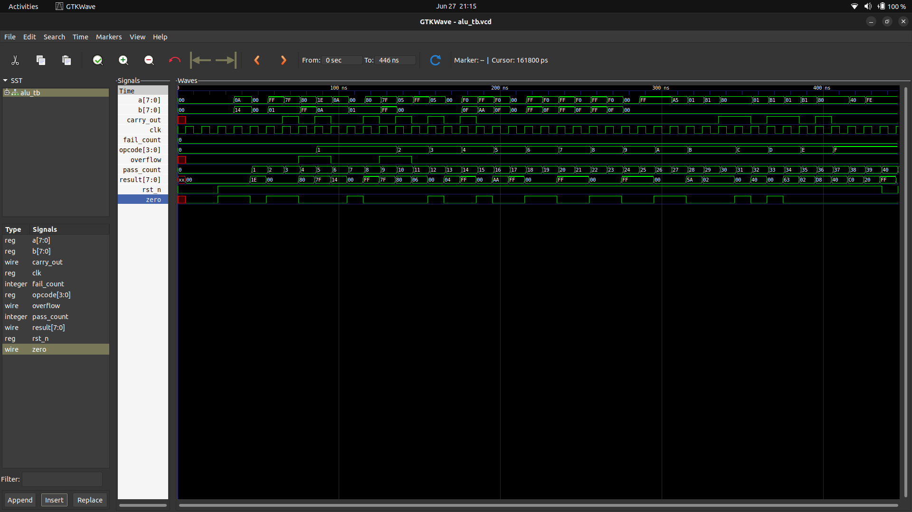
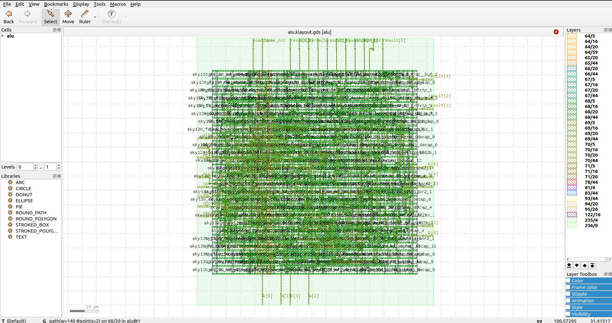

# 8-bit Parameterizable ALU — RTL to GDSII (Sky130)

A parameterizable 8-bit ALU taken from RTL through synthesis, place-and-route, and GDSII sign-off using the open-source Sky130 PDK and OpenLane 2.


---

## Overview

This project takes a parameterizable ALU from Verilog RTL all the way to a manufacturable GDSII layout, using a fully open-source toolchain. The goal was to personally drive every stage of the physical design flow — floorplanning, placement, CTS, routing, and sign-off — while treating RTL design as a supporting step rather than the focus.

- **Design:** 8-bit ALU (parameterizable to 4/16/32-bit), 16 operations, single clock domain, synchronous active-low reset
- **Simulation:** Icarus Verilog (iverilog) + GTKWave
- **Physical Design:** OpenLane 2 (Dockerized) + SkyWater Sky130 PDK (`sky130_fd_sc_hd`)
- **Result:** Clean DRC, LVS, and Antenna sign-off with 0 violations

---

## ALU Specification

| Parameter | Value |
|---|---|
| Data width | 8-bit (parameterizable: 4 / 8 / 16 / 32) |
| Opcode width | 4-bit |
| Operations | 16 |
| Reset | Synchronous, active-low (`rst_n`) |
| Clock | Single domain |

**Opcode Map**

| Opcode | Op | Opcode | Op |
|---|---|---|---|
| `0x0` | ADD | `0x8` | NAND |
| `0x1` | SUB | `0x9` | NOR |
| `0x2` | INC | `0xA` | NOT |
| `0x3` | DEC | `0xB` | SHL |
| `0x4` | AND | `0xC` | SHR |
| `0x5` | OR | `0xD` | ROL |
| `0x6` | XOR | `0xE` | ROR |
| `0x7` | XNOR | `0xF` | ARITH_SHR |

**Outputs:** `result[DATA_WIDTH-1:0]`, `carry_out`, `overflow` (signed, ADD/SUB only), `zero`

---

## Flow

```
RTL (Verilog) → Simulation (iverilog/GTKWave) → Synthesis (Yosys)
   → Floorplan → Placement → CTS → Routing → Sign-off (DRC/LVS/Antenna) → GDSII
```

All physical design stages were run through **OpenLane 2**, Dockerized to bypass native toolchain version issues:

```bash
python3 -m openlane --dockerized config.json
```

---

## Repository Structure

```
.
├── rtl/                  # ALU Verilog source
├── testbench/             # Self-checking directed testbench
├── constraints/            # SDC timing constraints
├── synthesis/              # Synthesis-stage config
├── pnr/
│   ├── config.json          # OpenLane configuration
│   └── reports/              # metrics.json, timing/area summaries
├── results/
│   ├── final_gds/             # Final signed-off GDSII
│   └── screenshots/             # Layout, waveform, terminal captures
└── docs/                     # Flow diagram
```

---

## Simulation Results

43 directed test cases covering all 16 opcodes, self-checking with PASS/FAIL scoreboard.

```
===== Testbench Complete =====
PASSED: 43
FAILED: 0
ALL TESTS PASSED
==============================
```

**Run it yourself:**

```bash
cd rtl
iverilog -o alu_sim -Wall alu.v ../testbench/alu_tb.v
vvp alu_sim
gtkwave alu_tb.vcd
```



---

## Physical Design Constraints

| Constraint | Value |
|---|---|
| Clock period | 10 ns (100 MHz) |
| Input delay | 2 ns |
| Output delay | 2 ns |
| Max transition | 1.5 ns |
| Max fanout | 4 |
| Core utilization | 45% |
| Standard cell library | `sky130_fd_sc_hd` |

---

## Results Summary

**Sign-off status — all clean:**

| Check | Result |
|---|---|
| DRC (Magic + KLayout) | ✅ 0 errors |
| LVS | ✅ 0 device/net/pin mismatches |
| Antenna | ✅ 0 violations |
| Magic vs KLayout XOR | ✅ 0 differences |
| Disconnected pins | ✅ 0 |

**Timing (worst across all PVT corners):**

| Metric | Value |
|---|---|
| Setup worst slack | 1.80 ns |
| Hold worst slack | 0.178 ns |
| Setup/hold TNS | 0 |
| Setup/hold violations | 0 |
| Max slew / max cap violations | 0 |

**Physical metrics:**

| Metric | Value |
|---|---|
| Die area | 82.3 µm × 93.0 µm (7658.18 µm²) |
| Core utilization | 52.8% |
| Standard cells placed | 450 |
| Sequential cells (DFFs) | 11 |
| Routed wirelength | 7320 µm |
| Routing vias | 2411 |
| Detailed routing DRC violations | 0 |
| Worst IR drop (VPWR) | 0.39 mV |

**Power:**

| Component | Value |
|---|---|
| Total power | 0.264 mW |
| Switching power | 0.094 mW |
| Internal power | 0.170 mW |
| Leakage power | ~2.5 nW |

Full machine-readable metrics: [`pnr/reports/metrics.json`](pnr/reports/metrics.json)

---

## Layout



---

## How to Reproduce

**Prerequisites:** Ubuntu, Docker, Icarus Verilog, GTKWave, [Volare](https://github.com/efabless/volare) (Sky130 PDK), OpenLane 2 Docker image (`ghcr.io/efabless/openlane2:2.3.10`)

**1. Simulate the RTL**

```bash
cd rtl
iverilog -o alu_sim -Wall alu.v ../testbench/alu_tb.v
vvp alu_sim
gtkwave alu_tb.vcd
```

**2. Run the physical design flow**

```bash
cd pnr
python3 -m openlane --dockerized config.json
```

**3. View the final layout**

```bash
klayout runs/<run-tag>/final/alu.gds
```

---

## License

This project is licensed under the [MIT License](LICENSE).

You're free to use, modify, and build on this project — for learning, coursework, or your own portfolio. **If you use this as a base for your own project, a credit/link back to this repo is appreciated.**

---

## Author

**Tejas Baru**
Electronics & Telecommunication Engineer | Aspiring VLSI Engineer
[LinkedIn](https://linkedin.com/in/tejas-baru-897b09135) · [GitHub](https://github.com/TejasBaru)
